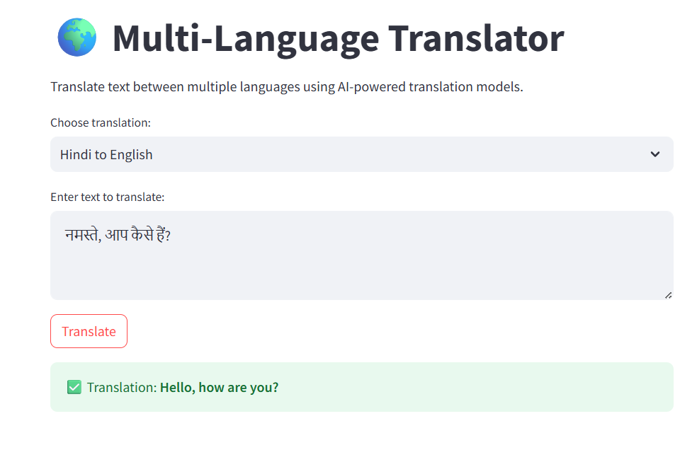
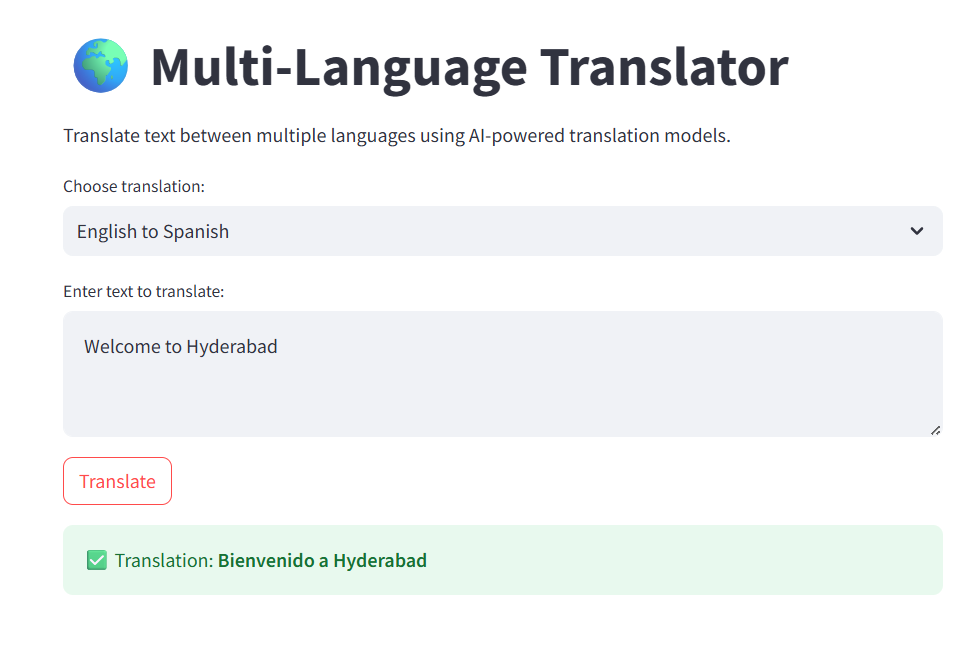

# AI-Powered Multi-Language Translator

## Overview

This project is an NLP-based multilingual translation application developed using Hugging Face MarianMT transformer models and Streamlit. It enables real-time translation between multiple languages using pre-trained transformer models.

## Features

- Real-time language translation
- Multiple language pairs supported
- Interactive Streamlit user interface
- Powered by Hugging Face Transformers
- Pre-trained MarianMT translation models

## Technologies Used

- Python
- Streamlit
- Hugging Face Transformers
- MarianMT Models
- PyTorch

## Workflow

User Input
→ Language Selection
→ Tokenization
→ Transformer Model Inference
→ Translation Generation
→ Output Display

## AI/NLP Concepts Used

- Natural Language Processing (NLP)
- Tokenization
- Transformer Architecture
- Sequence-to-Sequence Learning
- Transfer Learning
- Language Translation

## Project Structure

```text
Multi-Language-Translator-Using-HuggingFace
│
├── app.py
├── translator.py
├── req.txt
├── README.md
└── screenshots
```

## Sample Output

### Home Page


### Translation Result


## Future Enhancements

- Language auto-detection
- Voice-to-text translation
- Translation history storage
- Translation quality evaluation

## Author

Cynthana S
